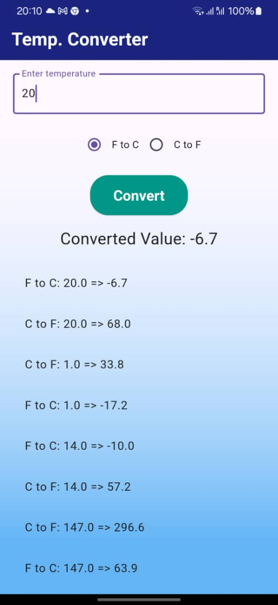

Sure! Here's a README for the Temperature Conversion App:

---

# Temperature Conversion App

This is a simple Flutter application that converts temperatures between Fahrenheit and Celsius. The app allows users to input a temperature value, select the conversion type, and view the converted result along with a history of past conversions.

## Features

- Convert temperatures from Fahrenheit to Celsius and vice versa.
- Input temperature value using a text field.
- Select conversion type using radio buttons.
- Display the converted temperature value.
- Maintain a history of past conversions.

## Screenshots



## Getting Started

### Prerequisites

- Flutter SDK: [Installation Guide](https://flutter.dev/docs/get-started/install)
- A code editor (e.g., Visual Studio Code, Android Studio)

### Installation

1. Clone the repository:

```bash
git clone https://github.com/your_username/temperature_conversion_app.git
```

2. Navigate to the project directory:

```bash
cd temperature_conversion_app
```

3. Install dependencies:

```bash
flutter pub get
```

### Running the App

1. Connect a physical device or start an emulator.
2. Run the app using the following command:

```bash
flutter run
```

## Code Explanation

### `TemperatureConversionScreen` Class

This class is a `StatefulWidget` that manages the state of the temperature conversion screen.

### `_TemperatureConversionScreenState` Class

This class contains the following state variables:
- `_controller`: A `TextEditingController` to handle the input temperature value.
- `_selectedConversion`: A string that stores the selected conversion type ('F to C' or 'C to F').
- `_convertedValue`: A string that stores the converted temperature value.
- `_history`: A list of strings that stores the history of past conversions.

### `_convertTemperature` Method

This method performs the temperature conversion based on the selected conversion type and updates the state variables `_convertedValue` and `_history`.

### UI Components

- `TextField`: Captures the temperature input from the user.
- `Radio` Buttons: Allow the user to select the conversion type.
- `ElevatedButton`: Triggers the conversion when pressed.
- `Text`: Displays the converted temperature value.
- `ListView.builder`: Displays the history of past conversions.

## Contributing

Contributions are welcome! Please follow these steps to contribute:

1. Fork the repository.
2. Create a new branch for your feature or bugfix.
3. Commit your changes.
4. Push the branch to your forked repository.
5. Open a pull request.

## Contact

If you have any questions or suggestions, feel free to contact me at n.peat@alustudent.com
